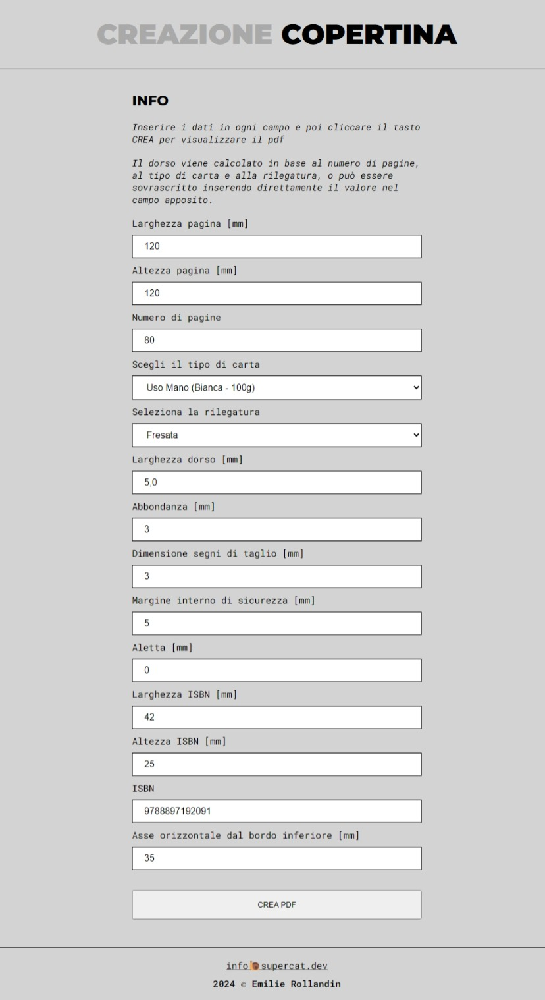
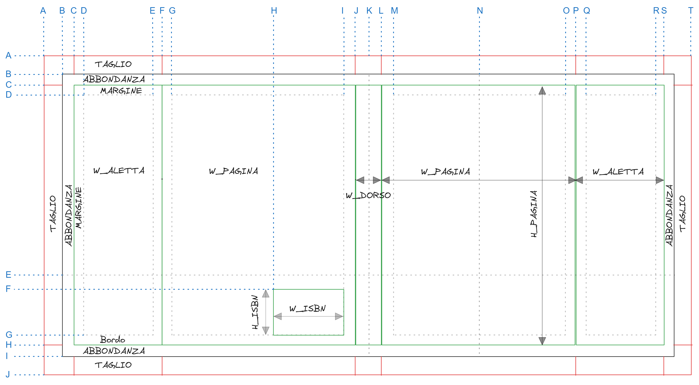

# BookCover PDF

BookCover PDF è una piccola applicazione HTML/JavaScript per generare la base tecnica PDF di una copertina editoriale.

Serve come punto di partenza per il lavoro grafico della casa editrice: l'app calcola la larghezza complessiva della copertina, il dorso, le eventuali alette, le linee tecniche, l'ISBN/EAN-13 e la riga orizzontale usata come riferimento grafico per la zona bassa della copertina.

[Demo](https://archistico.github.io/BookCoverPdf/)



## Esempio di PDF generato

L'output contiene le guide tecniche utili per impostare la copertina in un programma di grafica.



## Funzioni principali

- Calcolo automatico del dorso in base a:
  - numero pagine;
  - tipografia;
  - tipo carta;
  - rilegatura fresata o cucita.
- Dorso modificabile manualmente.
- Possibilità di bloccare il valore manuale del dorso.
- Gestione copertina con o senza alette.
- Linee di taglio, piega, abbondanza e sicurezza testi.
- Area di sicurezza del dorso quando il dorso è sufficientemente largo.
- Riga orizzontale di riferimento per la zona bassa della copertina.
- Generazione ISBN/EAN-13 con validazione completa.
- Correzione automatica del check digit ISBN partendo da 12 o 13 cifre.
- Preset formati pagina comuni.
- Salvataggio/caricamento preset nel browser.
- Import/export dei parametri in JSON.
- Possibilità di generare il PDF con guide tecniche oppure una versione pulita.

## Uso rapido

Aprire `index.html` nel browser, compilare i campi e premere **CREA PDF**.

Non è richiesto un server: l'app può funzionare anche aprendo direttamente il file HTML. Per un comportamento più simile a un ambiente web reale è comunque possibile servirla da una cartella locale, per esempio con un piccolo server HTTP.

Esempio con Python:

```bash
python -m http.server 8000
```

Poi aprire:

```text
http://localhost:8000
```

## Nome file PDF e anteprima nel browser

Il campo **Nome file PDF** viene rispettato quando si usa il download diretto tramite `doc.save(...)`.

Se invece il PDF viene aperto in anteprima in una nuova scheda, il browser usa un Blob URL temporaneo, per esempio:

```text
blob:null/7df8c68b-3689-4f0d-9dcf-67bcdfe9dcde
```

In quel caso, se si preme **Salva** dal visualizzatore PDF del browser, Chrome/Edge può proporre come nome file l'identificativo temporaneo del Blob invece del nome impostato nell'app. È un comportamento normale del browser, non un errore di jsPDF.

Per ottenere sempre il nome file corretto, attivare l'opzione **Scarica direttamente il PDF invece di aprirlo**.

## Calcolo dorso

Il dorso viene calcolato con questa formula:

```text
Dorso mm = (numero pagine / 2) * spessore_micron / 1000
```

Gli spessori sono espressi in **micron per foglio**.

Esempio:

```text
160 pagine
spessore carta = 125 micron
fogli = 160 / 2 = 80
Dorso = 80 * 125 / 1000 = 10 mm
```

Se si modifica manualmente il campo **Larghezza dorso**, l'opzione **Blocca valore dorso manuale** viene attivata automaticamente. In questo modo il valore non viene sovrascritto al cambio di carta, pagine o rilegatura.

## Tipografie e spessori carta

Gli spessori carta sono definiti in `tipografie.js`.

La scelta avviene su tre livelli:

```text
Tipografia → Carta → Rilegatura
```

La struttura dati è questa:

```js
const TIPOGRAFIE = [
    {
        id: 'universalbook',
        nome: 'UniversalBook',
        provvisorio: false,
        carte: [
            {
                carta: 'uso-mano-bianca-100g',
                nome: 'Uso Mano (Bianca - 100g)',
                fresata: 125,
                cucita: 140
            },
        ],
    },
];
```

Profili presenti:

- **UniversalBook**: tabella compilata con i valori forniti.
- **Elui Tipografia**: profilo predisposto e separato, con valori provvisori da sostituire quando saranno disponibili i dati ufficiali.
- **Generica / da verificare**: valori indicativi per prove interne o preventivi.

Se una tipografia o una carta è marcata con:

```js
provvisorio: true
```

l'app mostra un avviso non bloccante prima della generazione del PDF.

Per aggiornare gli spessori di una tipografia è sufficiente modificare il relativo blocco in `tipografie.js`, senza toccare la logica di generazione PDF.

## ISBN / EAN-13

L'app gestisce ISBN-13 con prefisso `978` o `979`.

Controlli effettuati:

- 13 cifre obbligatorie per la validazione completa;
- prefisso `978` o `979`;
- check digit EAN-13 corretto;
- blocco della generazione se l'ISBN non è valido.

Il pulsante **Calcola / correggi check digit ISBN** permette di:

- inserire 12 cifre e ottenere automaticamente la tredicesima;
- inserire 13 cifre e correggere l'ultima cifra se il check digit è errato.

Nota: la sillabazione editoriale completa dell'ISBN richiederebbe le tabelle ufficiali dei gruppi e degli editori. Per evitare separazioni apparentemente ufficiali ma potenzialmente errate, la formattazione testuale resta semplice.

## Guide tecniche nel PDF

Con l'opzione **Disegna linee e guide tecniche** attiva, il PDF contiene:

- abbondanza;
- taglio;
- pieghe;
- sicurezza testi;
- sicurezza dorso;
- riferimenti delle alette, se presenti;
- ISBN/barcode;
- riga orizzontale di riferimento.

Disattivando l'opzione, viene generata una versione più pulita, utile quando si vuole mantenere solo l'elemento ISBN/barcode o avere una base meno carica di segni tecnici.

## Preset e JSON

L'app permette di:

- salvare un preset nel browser;
- ricaricare il preset salvato;
- esportare i parametri in JSON;
- importare i parametri da JSON.

Il preset del browser resta memorizzato localmente sul computer in uso. L'export JSON è invece più adatto per archiviare o passare una configurazione da un lavoro a un altro.

## Struttura file

```text
index.html          Interfaccia utente
style.css           Stile della pagina
script.js           Validazione interfaccia e disegno del PDF
isbn.js             Validazione ISBN-13 e codifica EAN-13
geometry.js         Calcolo coordinate e dimensioni della copertina
tipografie.js       Profili tipografia, carte e spessori per rilegatura
jspdf.umd.min.js    Libreria jsPDF
screenshot.png      Schermata dell'app usata nel README
pagina_fili.png     Esempio di pagina/PDF tecnico generato
pagina_fili.svg     Versione SVG dell'esempio pagina fili
tests/test.js       Test automatici senza dipendenze esterne
readme.md           Documentazione del progetto
```

## Test

Con Node.js installato:

```bash
node tests/test.js
```

Risultato atteso:

```text
Tutti i test sono passati.
```

Per un controllo sintattico dei file principali:

```bash
node --check isbn.js
node --check geometry.js
node --check tipografie.js
node --check script.js
```

## Note operative

- Prima della stampa definitiva verificare sempre con la tipografia gli spessori carta, soprattutto per i profili marcati come provvisori.
- Il numero pagine dovrebbe essere coerente con il tipo di lavorazione editoriale richiesta. L'app mostra avvisi per numeri dispari o non multipli di 4, ma non blocca automaticamente la generazione.
- Se il dorso è molto stretto, l'app segnala che il testo sul dorso è sconsigliato o da verificare.
- Le guide tecniche sono pensate come base di lavoro grafico, non come sostituto delle specifiche definitive della tipografia.
